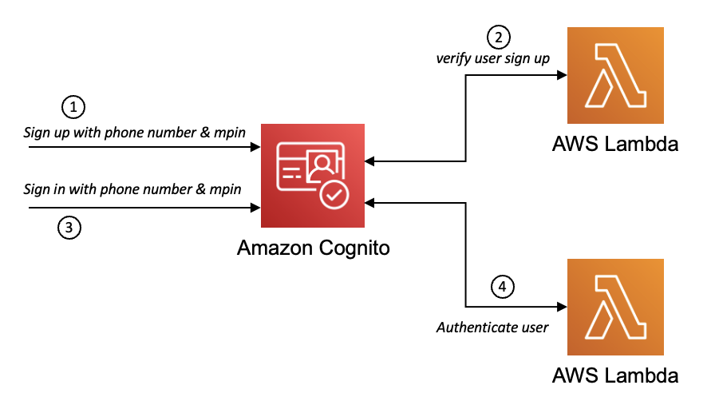

# Authentication using custom attributes in Amazon Cognito
Amazon Cognito user pools are often used by the customers of AWS for managing users and authentication. Amazon Cognito natively provides features for sign up and sign in with username, email and phone number. But mostly mobile customer look for easy sign up and sign in using custom attributes for their choice instead of username/email/phone number & password. This solution will demonstrate how use Amazon Cognito to sign up and sign in with custom attributes using phone number and mpin.

## Getting Started
The entire solution is built on Java11 and SAM. The instructions below shows the prerequisities, deployment instructions and testing steps.
### Architecture Diagram


### Prerequisites
* AWS account
* AWS CLI installed and configured
* Java 11
* Apache Maven
* AWS SAM CLI
### Deployment Instructions
1. Create a new directory, navigate to that directory in a terminal and clone the GitHub repository.
2. Go inside the directory using ```cd <directory name>``` command.
3. Use AWS SAM to build the application:
    ```
   sam build
    ```
4. Use AWS SAM to deploy the AWS resources
    ```
   sam deploy --guided
    ```
5. During the prompts:
    * Enter a stack name
    * Enter the desired AWS Region
    * Allow SAM CLI to create IAM roles with the required permissions.

    Once you have run `sam deploy --guided` mode once and saved arguments to a configuration file (samconfig.toml), you can use `sam deploy` in future to use these defaults.
6. Copy the value of `MobileClientId` from the output once SAM executes successfully.
### How it works
Amazon Cognito can be customized using the Lambda Triggers for different flows. This solution used the lambda triggers to support custom authentication. There are two different lambda functions used in PreSignUp and PreAuthentication triggers. The PreSignUp lambda function is used for user verification using custom attributes whereas the PreAuthentication is used for authenticating the user with the custom attributes.
### Testing
This solution is tested using aws cli. It can also be done using AWS Javascript SDKs.
1. Sign up a user with phone number using aws cli. Please cognito expects a password during sign up and sign in, please pass a hardcoded password directly from your app without exposing it to mobile user.
```
aws cognito-idp sign-up --username <phone-number-with-countrycode> --password Password1# --client-id <MobileClientId>  --user-attributes Name=custom:mpin,Value=1234
```
2. On successful execution of the above command should return a JSON response with user confirmed as true.
3. Sign in using the same attributes used for sign up. Here too, you would need to pass the same hardcoded password.
```
aws cognito-idp initiate-auth --client-id <MobileClientId> --auth-flow USER_PASSWORD_AUTH --auth-parameters USERNAME=<phone-number-with-countrycode>,PASSWORD="Password1#" --client-metadata phone_number=<phone-number-with-countrycode>,password="",mpin=1234
```
4. On successful sign up, it will return the tokens as JSON response.
5. To validate the error scenario, execute the command in step 3 with different mpin, it will return an error message.
### Clean up
Clean up the resources by running the following command and input `y` for the next subsequent question:
```
sam delete
```
### License
This project is licensed under the terms of the MIT license.
